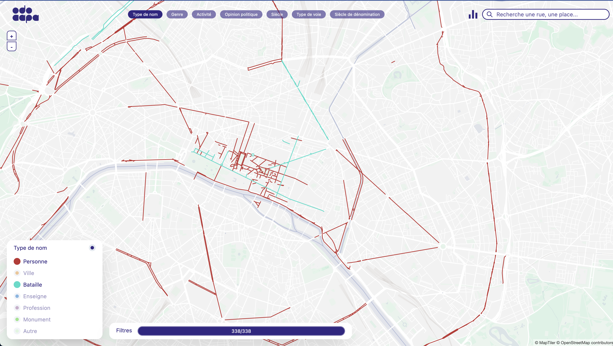
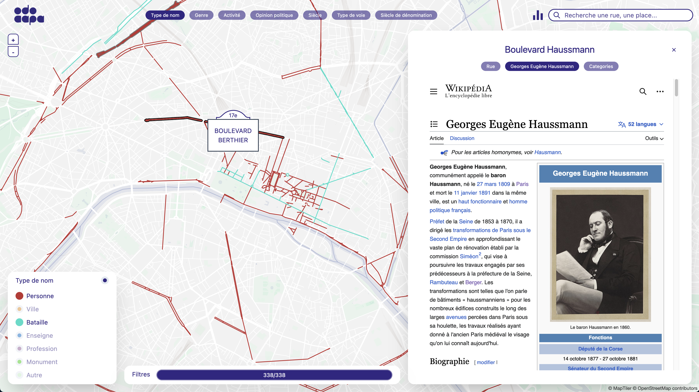
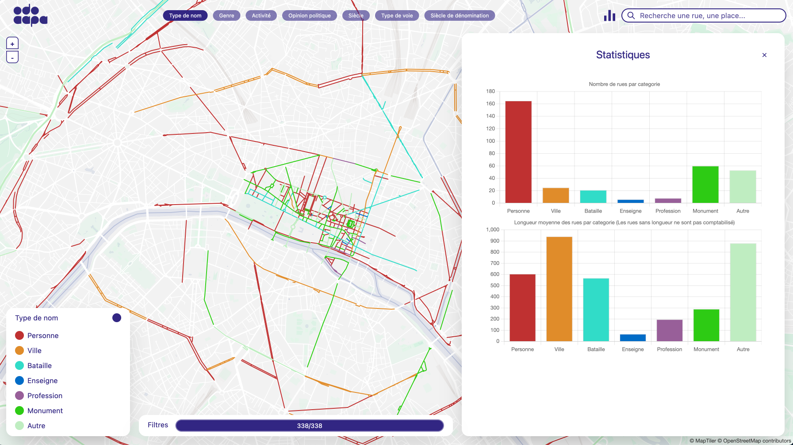
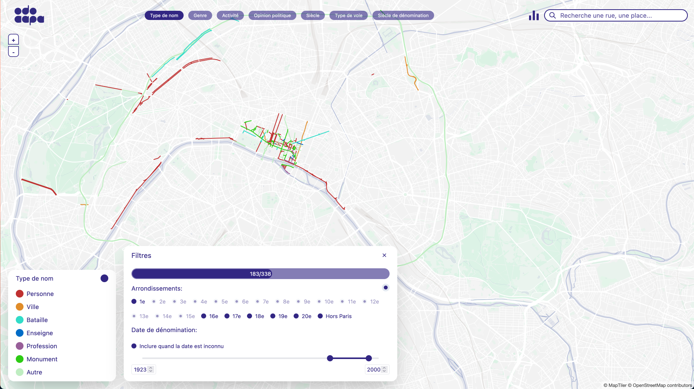
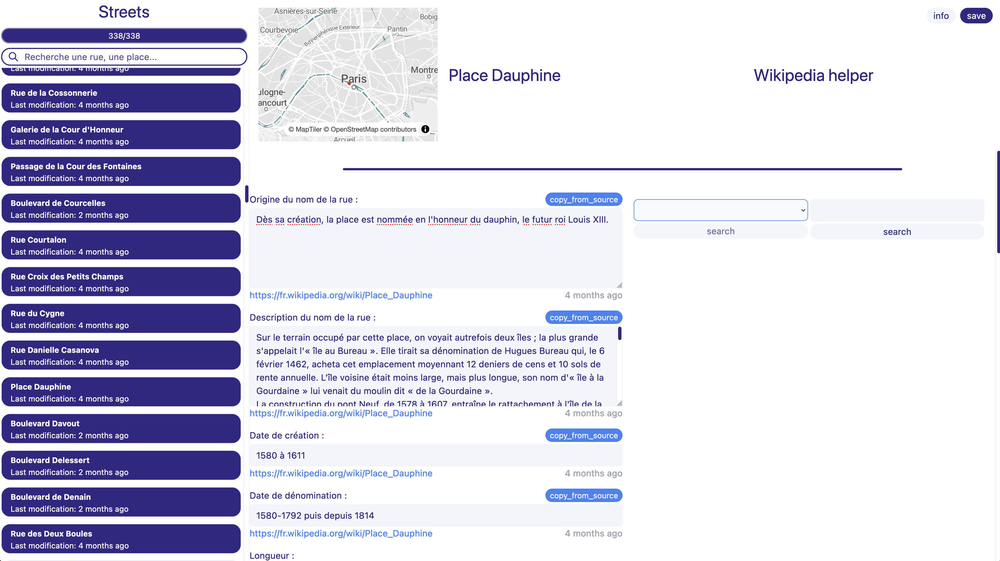

# ODOCAPA

ODOCAPA is a web project about Paris street toponymy. It allow users to learn more about the **history** of Paris streets, streets naming and those whose streets took their name from.

Work in progress link to the project development version: https://odocapa-4a31f.web.app/

## Data sources

- [Dénominations des emprises des voies actuelle](https://opendata.paris.fr/explore/dataset/denominations-emprises-voies-actuelles/information/) - Mairie de Paris, 21/11/2022, under license [ODbL : Open Database License](https://opendatacommons.org/licenses/odbl/)
- [Linéaires des Voies](https://opendata.paris.fr/explore/dataset/voie/information/) - Mairie de Paris, 21/11/2022, under license [ODbL : Open Database License](https://opendatacommons.org/licenses/odbl/)
- A big part of project content is from Wikipedia under license [CC BY-SA 3.0 Unported](https://fr.wikipedia.org/wiki/Wikip%C3%A9dia:Licence_Creative_Commons_Paternit%C3%A9-Partage_des_Conditions_Initiales_%C3%A0_l%27Identique_3.0_non_transpos%C3%A9)

## Features

*The odocapa interface*

*Panel info about the selected street*

*Stats*

*Street filters*

*Admin interface to configurate streets*

## Project structure

- [/firebase](/firebase): firebases function to handle 
- [/front-vite](/front-vite): react application

## License

[GNU General Public License v3.0](/gpl-v3.0.txt)